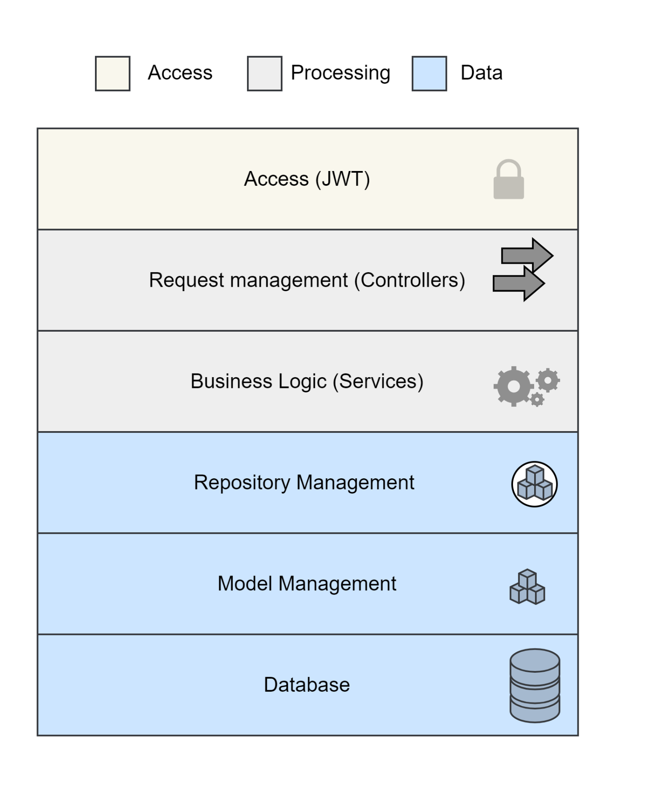

# Architecture

JUB API enforces a strict four-layer architecture that separates HTTP concerns, business logic, and data access.

```
HTTP Request
     │
     ▼
┌─────────────────────┐
│     Controller      │  jubapi/controllers/v2/
│  (HTTP boundary)    │
└─────────┬───────────┘
          │  calls service methods
          ▼
┌─────────────────────┐
│      Service        │  jubapi/services/v2/__init__.py
│  (business logic)   │
└─────────┬───────────┘
          │  calls repository methods
          ▼
┌─────────────────────┐
│     Repository      │  jubapi/repositories/v2/__init__.py
│  (data access)      │
└─────────┬───────────┘
          │  queries
          ▼
┌─────────────────────┐
│      MongoDB        │  (Motor async driver)
└─────────────────────┘
```

<p align="center">
  
</p>

---

## Layer Responsibilities

### Controller layer — `jubapi/controllers/v2/`

Each controller file owns one `APIRouter` mounted on a path prefix.

**Rules:**

- Validate input DTOs (Pydantic handles this automatically).
- Inject services via FastAPI `Depends()`.
- Unwrap the `Result` and call `.to_http_exception()` on errors — never catch raw exceptions.
- Never contain business logic or import from another controller.

**Files:**

| File | Prefix | Responsibility |
|---|---|---|
| `observatories.py` | `/observatories` | Observatory CRUD, bulk provisioning, catalog/product links |
| `catalogs.py` | `/catalogs` | Catalog CRUD, bulk creation with items and aliases |
| `catalog_items.py` | `/catalog-items` | Catalog item CRUD, alias management |
| `products.py` | `/products` | Product CRUD, tag management, file upload |
| `datasources.py` | `/datasources` | Data source CRUD, record ingestion, DSL query |
| `search.py` | `/search` | Product search, raw record fetch, plot generation |
| `tasks.py` | `/tasks` | Task list, detail, retry, external completion |
| `users.py` | `/users` | Sign-up, login, profile, settings |

### Service layer — `jubapi/services/v2/__init__.py`

All business logic lives in a single module. Services are instantiated per-request by the dependency factories in `middlewares/__init__.py`.

**Rules:**

- Always return `Result[T, JubError]` — never raise exceptions.
- Catch all exceptions and convert to `Err(JubError(...))`.
- Coordinate multiple repositories for cross-collection operations.
- Convert between domain `Model` and `DTO` — controllers never see raw models.

**Key classes:**

| Class | Responsibility |
|---|---|
| `GraphLinkManager` | Central manager for all entity-to-entity link collections |
| `ObservatoriesService` | Observatory lifecycle, catalog/product linking, enable/disable |
| `CatalogService` | Catalog creation, bulk ingestion, full tree hydration |
| `ProductService` | Product creation, tagging, observatory assignment |
| `SearchService` | DSL product search, raw record fetch, plot aggregation, identifier resolution |
| `DataIngestionService` | Data source registration, bulk record insertion |
| `DataQueryService` | DSL-driven record queries scoped to a data source |
| `TasksService` | Task creation, completion, retry, statistics |

### Repository layer — `jubapi/repositories/v2/__init__.py`

All repositories extend `BaseRepository[T]` which provides typed access to a MongoDB collection.

```python
async def insert(model: T)          -> Result[str, JubError]
async def get_by_id(id: str)        -> Result[T,   JubError]
async def find(query, limit)        -> Result[List[T], JubError]
async def update(id, data: dict)    -> Result[T,   JubError]
async def delete(id: str)           -> Result[bool, JubError]
async def count(query: dict)        -> Result[int, JubError]
```

---

## Result Pattern

Every service and repository method returns `Result[T, JubError]` from the `option` library.

```python
from option import Ok, Err

# Returning success
return Ok(value)

# Returning a known error
return Err(EX.NotFound(f"Observatory '{id}' not found."))

# Unwrapping in a controller
result = await svc.do_something()
if result.is_err:
    raise result.unwrap_err().to_http_exception()
value = result.unwrap()
```

This pattern eliminates uncontrolled exception propagation across layer boundaries.

---

## DTO and Model Separation

| Concept | Location | Purpose |
|---|---|---|
| **Model** | `jubapi/models/v2/__init__.py` | Internal domain entities stored in MongoDB |
| **DTO** | `jubapi/dto/v2/__init__.py` | Request / response shapes for API clients |

**Data flow:**

```
Client JSON  →  DTO (Pydantic validation)  →  Model (in Service)  →  MongoDB
MongoDB      →  Model (from repo)          →  DTO (in Service)    →  Client JSON
```

Controllers receive DTOs and return DTOs. Models never cross the controller boundary.

!!! note "UpperSnakeStr"
    String fields tagged `UpperSnakeStr` on domain models are automatically normalised to
    `UPPER_SNAKE_CASE` on assignment — e.g. `"breast cancer"` → `"BREAST_CANCER"`.

---

## Dependency Injection

FastAPI dependency factories in `jubapi/middlewares/__init__.py` wire repositories into services:

```python
# Controller usage
async def my_route(svc: ObservatoriesService = Depends(MX.get_observatories_service)):
    ...
```

Swapping a dependency (e.g. the storage backend) only requires changing the factory — no service or controller code changes needed.


