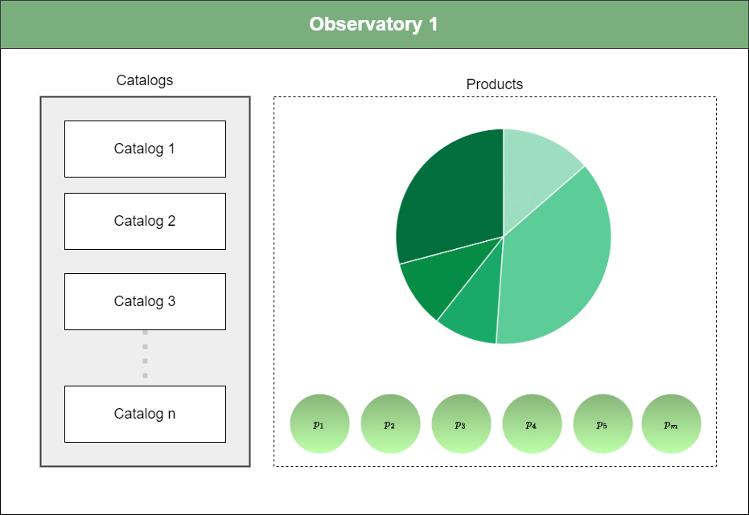

# JUB API

**JUB API** is a RESTful API that lets you build **observatory-based data platforms** — dynamic, multi-dimensional spaces where products (datasets) are discovered and queried through a structured catalog vocabulary and a concise domain-specific language (DSL).

<p align="center">

</p>

---

## Core Concepts

### Observatory

An **Observatory** is a scoped workspace that groups a set of catalogs and products around a shared theme. It acts as the root context for all queries and visualisations.

- Observatories start **disabled** during provisioning and are enabled once fully set up.
- A single platform can host multiple observatories (e.g. *Cancer Observatory*, *Demographic Observatory*).

### Catalog

A **Catalog** is a typed vocabulary of items used to tag and filter products. Every catalog item carries an `id`, a human-readable `name`, a normalised `value`, and a numeric `code`.

| Catalog type | Purpose | Examples |
|---|---|---|
| `spatial` | Geographic dimensions | Country, State, Municipality |
| `temporal` | Time dimensions | Year, Month, Date range |
| `interest` | Categorical / demographic | Disease type, Sex, Age group |

Catalogs support arbitrary depth hierarchies (e.g. Country → State → Municipality) and multiple aliases per item so users can query by code, name, or any alternative label.

### Product

A **Product** represents a concrete dataset or report. Products are tagged with catalog items across multiple dimensions, which makes them discoverable by the DSL search engine.

### Data Record

A **DataRecord** is a single aggregated row inside a data source. It stores resolved catalog-item IDs in `spatial_id`, `interest_ids`, and a datetime in `temporal_id`, plus numeric variables in `numerical_interest_ids` for metric calculations.

### Query Language (DSL)

The JUB DSL lets you express complex multi-dimensional queries in a single string:

```
jub.v1.VS(MX).VT(>= 2020).VI(C_MAMA OR C_OVARIO).VO(AVG(TASA_100K)).BY(CIE10_CANCER)
```

See the full [Query Language reference](query-language.md).

---

## Quick Navigation

| I want to… | Go to |
|---|---|
| Set up the project locally | [Getting Started](getting-started.md) |
| Understand the code structure | [Architecture](architecture.md) |
| Learn the data model | [Data Model](data-model.md) |
| Write DSL queries | [Query Language](query-language.md) |
| Follow the provisioning workflow | [Use Cases](use-cases.md) |
| Look up an endpoint | [API Reference](api-reference.md) |
| Swap the storage backend | [Storage Backend](storage.md) |

---

## Base URL

All v2 endpoints are served under:

```
/api/v2
```

Interactive documentation (Swagger UI) is available at `/docs` when the server is running.

